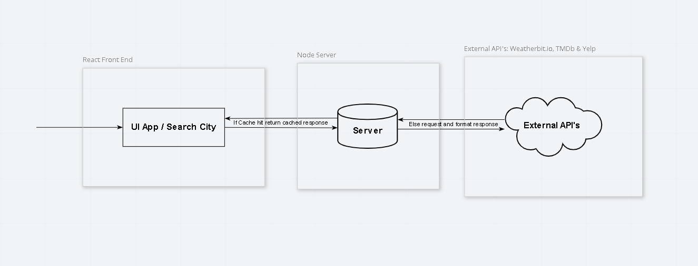

# City Explorer API

## Getting Started

1. Get an API keys and set in your `.env` file

 * [Weatherbit.io](https://www.weatherbit.io/) to `WEATHER_API_KEY=<Your API Key>`

 * [The Movie Db (TMBd)](https://www.themoviedb.org/) to `MOVIE_API_KEY=<Your API Key>`

 * [Yelp Fusion API](https://www.yelp.com/fusion) to `YELP_API_KEY=<Your API Key>`

2. Install Dependencies

  ```bash
  npm install
  ```

3. Start Server

  ```bash
  npm start
  ```

4. Open Cypress Test Runner (Optional)

  ```bash
  npm run test:open
  ```

5. Run Cypress Tests Headless (Optional)

  ```bash
  npm run test:run
  ```

## Web Request Response Cycle Diagram



## Tasks to Complete

### Lab - 10

#### Task 1 - Use Server Cache for Performance

Estimate of time needed to complete: 3 hours

Actual time needed to complete: 2 hours WIP

#### Task 2 - See info about restaurants in the city

Estimate of time needed to complete: 3 hours

Actual time needed to complete: 2 hours WIP
